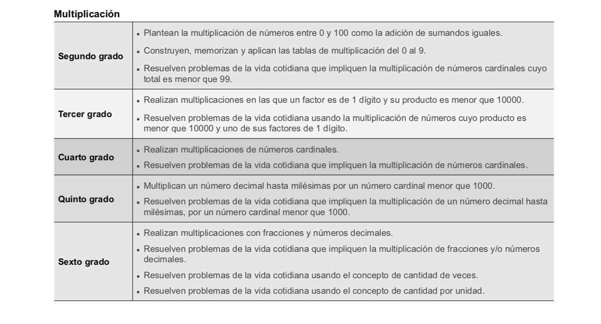
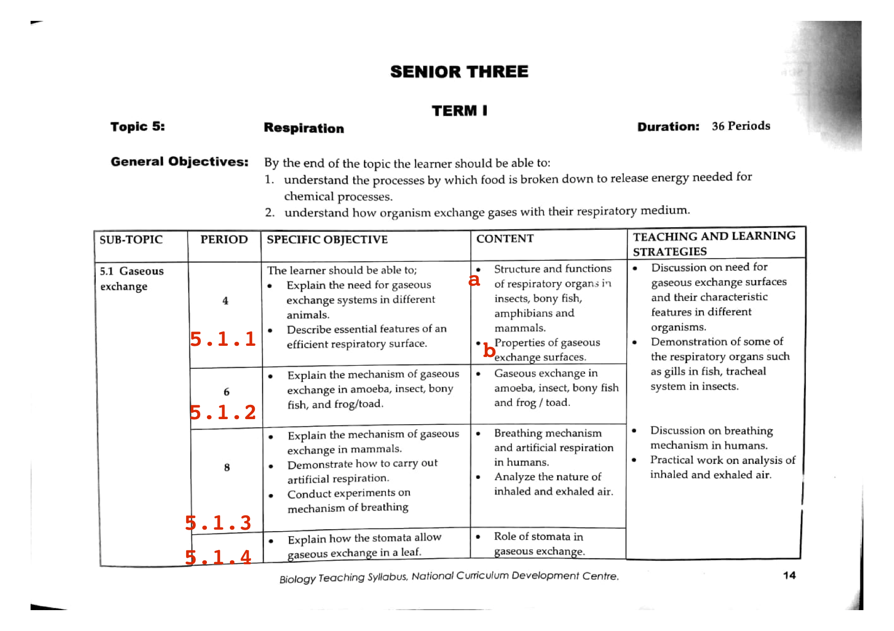
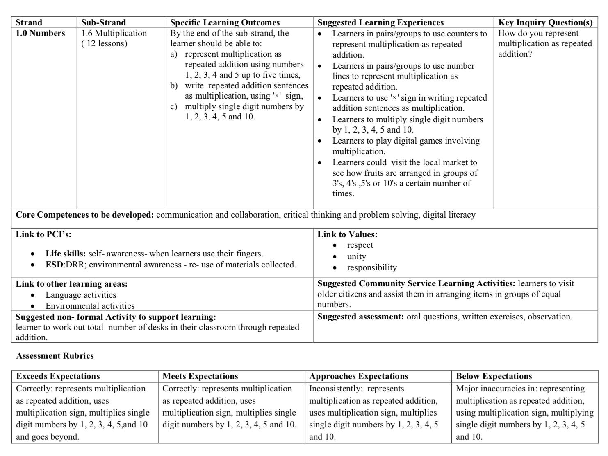
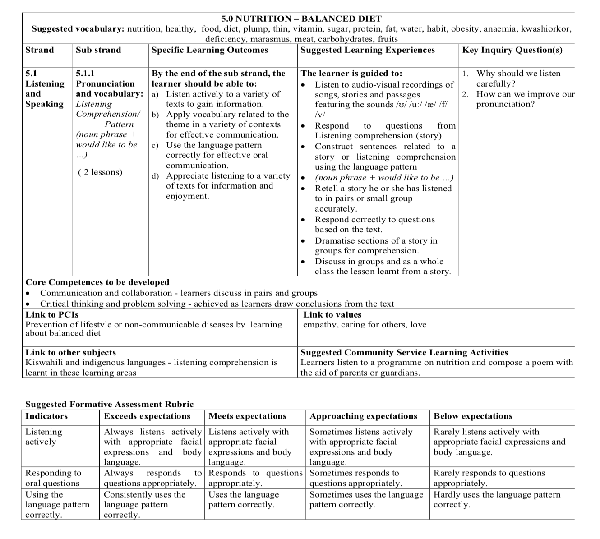
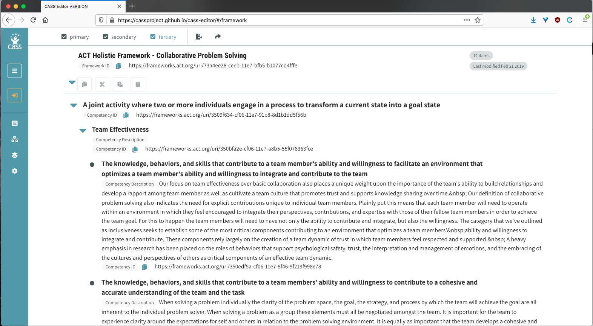
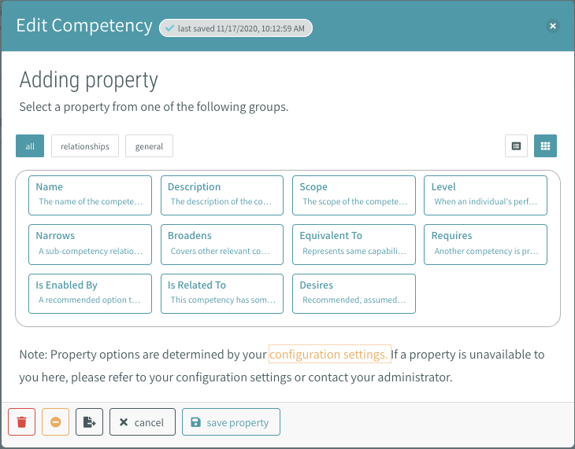
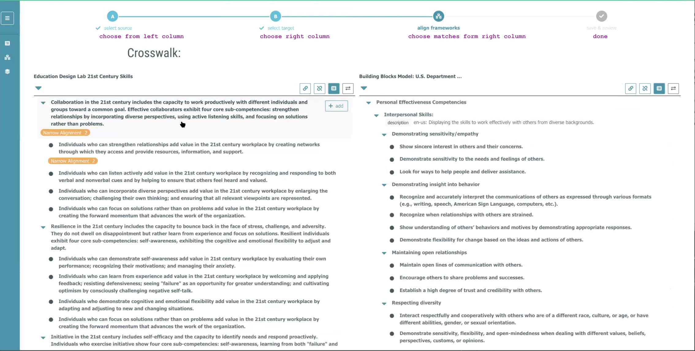
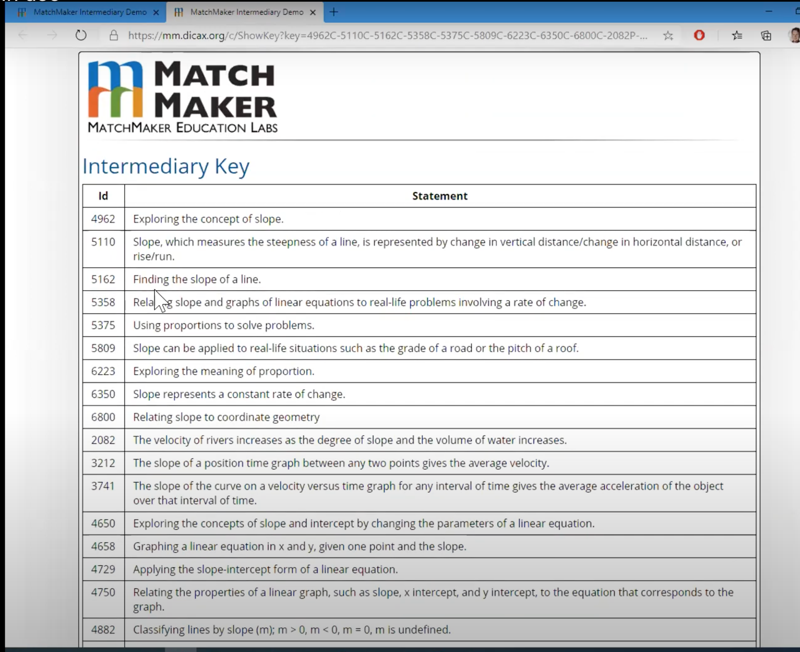

**CHANGELOG**

 - 2020-11-17: added representative examples from several curriculum documens
 - 2020-11-09: added links to CTDL-ASN, CaSS editor, IEEE 1484.20.1-2007, ESCO, RSD, and InLOC.
 - 2020-11-04: initial draft covering general context and ASN, CASE, LOM, LRMI.


# Introduction

Educational systems around the world are increasingly based on curriculum standards.
These standards are intended to be used as the blueprint for all components of
the educational system:
 - Standards define what should be taught (content standards). what skill students
   should develop (competency standards),
   and the level of proficiency students must attain (proficiency standards)
 - Content producers use these standards to create textbooks "aligned" to the standards
 - Educational institutions use the standards to plan their programs
 - Teachers use the standards to build the curriculum for their classes
 - Examination  are created to test the specific knowledge/skills defined in the standards

Curriculum standards usually describe what learners should know at different
grades in a given subject and specific competencies they must demonstrate.
Curriculum standards are made of individual statements with well-defined expectations,
and are usually organized in hierarchical structures like:

```
  Subject
    > Grade
       > Topic
          > Subtopic
             > Benchmark
```
Each level of this hierarchy defines specific descriptions of the content,
learning objectives, and competencies that are expected of students.

The structure and content of curriculum standards varies widely.
Each standard entries can have any subset of the following attributes:

* **Path**: the position of statement within the document (e.g. Ghana > Math > B4).
* **Kind / Label**: a label that describes the kind of entry (what level of the hierarchy).
* **Code / Statement Notation**: a human-readable short code like [`2.MD.D.10`](http://www.corestandards.org/Math/Content/2/MD/D/10/)
* **Identifier / URI**: a machine-readable code that identifies this curriculum standard entry (only available in standards in digital form).
* **Description**: the full statement of the learning standard or performance expectation. This can be anywhere from a few words to a whole paragraph.
* **Title or short description**: sometimes a standard entry will have a title or an abbreviated version of the main statement.
* **Learning objectives / Specific objectives / Specific outcomes**: these are usually presented as a form of a list that is associated with a given standard entry, or groups of standard entries.
* **Content / Knowledge**: usually presented in the form of keywords or topics.
* **Extended attributes**. These attributes are not present in all curriculum documents, but often contain important additional information.
  * **Teaching time allocation**: guidance about how much class time to dedicate to this part of the curriculum.
  * **Suggested learning activities**: either examples or general types of resources that can be used for learning the given standard entry.
  * **Teaching strategies / Suggested instructional methods**: similar to the above, but with suggestions to targeting the teacher.
  * **Content references**: reference to a specific textbook or other document
  * **Assessment notes**: description or examples of assessment items that can be used to evaluate learner's knowledge on this standard entry.
  * **Connections to other standard entries** (horizontal alignment notes)
  * **Connections to earlier entries in a progression** (vertical alignment)
  * **Practices / Core ideas / Cross-cutting concepts**: these mentions provide information about aspects of the curriculum that are not captured by the primary hierarchy of the document.
  * **Benchmarks / Rubrics**: specific criteria used to evaluate the level of attainment of the skills/competency described by the standard entry.
  * **Values / Skills**: other explicit goals of the curriculum that are not captured by any of the other categories, including non-academic goals.
  * **Key Inquiry Questions**: central questions to organize a class on this topic.
  * **Notes**: clarifications, additional information, and non-statutory guidance.

The wide variability of the structure and information contained in each standard
poses a difficult challenge when trying to create computer representations of them.


# Curriculum documents examples

## Document examples

The folder [`CurriculumDocs`](https://github.com/rocdata/research/tree/main/CurriculumDocs) contains examples
of complete curriculum standards documents form several countries.

In the next section we'll present excerpts of individual statements from each of these documents.


## Standard statements examples

In order to understand great variability of information associated with standards statements,
we'll now look at representative excerpts of individual statements from different countries.


### Example: Australia

Australia is an excellent example of what is possible when curriculum standards are available.

- Australia published [controlled vocabularies](http://vocabulary.curriculum.edu.au/) that define things like
  audience level, curriculum elements, learning resource types, school levels, and even a controlled vocabulary of topics.
- Published the **Australian Curriculum** standards on a well-organized website [www.australiancurriculum.edu.au](https://www.australiancurriculum.edu.au).
   - The standards are freely available as a [PDFs](https://www.australiancurriculum.edu.au/f-10-curriculum/mathematics/pdf-documents/) or in [machine readable form](http://rdf.australiancurriculum.edu.au/).
   - Each standard statement has associated a unique identifier.
- They defined specific metadata and tagging schemes for describing content correlations of learning resources
- They have a web portal with learning resources [scootle.edu.au](https://www.scootle.edu.au/ec/p/home) aligned to specific standards

Notes:
 - The Australia digital learning resources metadata efforts (MEX, SHEX) assumed a "closed system" model where all content is produced within Australia and tagged appropriately. Their [current projects](https://www.scootle.edu.au/ec/p/faq#decommOne) will rely on "open system" with publishers independently producing materials, but curriculum correlation tags will continue to play a role.


### Example: Honduras mathematics

The Honduras educational standards (Estándares Educativos Nacionales) are an interesting case
because they are available in two alternative organizations: by grade level and by topic.

Curriculum standards for Grade 2 Math, in the block "Números y Operaciones":


The same statements also appear appear in the "Multiplicación" component progression across levels:


Notes:
 - The Honduras standards do no have unique identifiers associated with each statement, so we would need to invent them.
   For example, the three statements in "Matemáticas > Segundo grado > Números y Operacione > Multiplicación"
   could be tagged with `Mate.2.NO.M.1`, `Mate.2.NO.M.2`, `Mate.2.NO.M.3`.
 - The Honduras curriculum standards are a good example of a single-hierarchy structure:
   the subjects, blocks, components, and statements can be represented as a tree.


### Example: Kenya Western music topics

The KICD curriculum standards for Music are a good example a topic that appears repeatedly in several grade leves.
The topic "Western music"  appears in Form One, Form Two, Form Three, and Form Four with progressively more details:


### Example: Uganda Biology

This is an example of a curriculum standard presented in table format,
with different components presented in the columns of the table.

The figure below shows the first part of the topic "Biology > Senior Three > Term I > Topic 5":

See here for [part two](CurriculumSamples/01_Uganda_Biology_5.1_Gaseous_exchanges/document_section_002.png)
and [part three](CurriculumSamples/01_Uganda_Biology_5.1_Gaseous_exchanges/document_section_003.png) of the statement.

Notes:
 - This topic contains two subtopics "5.1 Gaseous exchanges" and "5.2 Tissue respiration"
 - This sections within each sub-topic do not have titles—they simply correspond to different groups of specific objectives and content.
    We have assigned identifiers (numbers shown in red) to represent these sections.
 - This standard statement has been manually transcribed to digital form, see [here](https://docs.google.com/spreadsheets/d/1-ei7BBMOx0udbXxyLJjMPYLW0EJWg9wFUyV9ODa8m5o/edit#gid=1733263132)


### Example: Kenya new CBC

The new Kenya CBC (competency based curriculum) standards are very detailed and include 
numerous components, dimensions, and cross cutting concerns, all presented in tables.

Example for the math sub-strand: Mathematics > Grade 2 > 1 Numbers > 1.6 Multiplication:


Another example for the English sub-strand English > Grade 4 > 5 Nutrition > 5.1 Listening and Speaking > 5.1.1 Pronunciation and vocabulary:



Notes:
 - Note the number of different elements specified in the standard (time allocation, specific learning outcomes, suggested learning experiences, key questions, core competencies, learning areas links, etc.)
 - Creating a faithful and complete digital representation of all the information in this table will be a significant challenge:
   we would either need a very flexible/extensible data model or have to represent only part of the information.


### Example: Ghana

The Ghanian curriculum standards are available as [PDFs from the NaCCA website](https://nacca.gov.gh/?page_id=9230). 
Each statements in the Ghanian curriculum standards has an identifier of the form `Bx.y.z.v.w`,
where `x` is the grade level,
`y` is the strand number,
`z` is the sub-strand number,
`v` is standard number,
and `w` is learning indicator number.
The same structure is used in all subjects, so we'll only show two representative examples.


English example `B4.2.6.2`:


Math example `B4.1.5.1`:


The folder [`CurriculumSamples/06_Ghana`](https://github.com/rocdata/research/tree/main/CurriculumSamples/06_Ghana) contains additional examples.

Notes:
 - The Ghanian curriculum standards contain a lot of useful examples, which would be important to capture as part of the digitization process.
 - The examples contain math equations, images, and illustrations.


 

# Schemas for curriculum standards 

We'll now summarize some prior work done towards building data models for
curriculum standards, which has been an active area of research for the past 20 years.

There are three notable prior efforts to produce a schema for digital curriculum documents:

* Achievement Standards Network (ASN)
* Credential Transparency Description Language (CTDL-ASN)
* Competencies & Academic Standards Exchange (CASE) 

We'll provide detailed notes for each standard and related research below.


## Achievement Standards Network

The Achievement Standards Network (ASN) the most substantial effort to date to
define a data model for curriculum documents.
Achievement Standards Network Development of the ASN-DF dates back to 2000 and
gained significant momentum with near decade-long funding from the
U.S. National Science Foundation (NSF) starting in 2002 to the Information School
at the University of Washington and its collaborator, JES & Co., a U.S. non-profit.

> The ASN uses an entity-relationship model with two entities - Standard Document and Statement. These entities are each assigned an inherently globally unique Uniform Resource Identifier (URI). ASN URI's are "resolved" over the web via the ASN Resolution Service. The most basic resolution is the HTML view that you see when you visit any ASN URI in your web browser but the real interoperable magic happens when you request a RDF serialization for a particular ASN URI.
-- [source: ASN overview](http://www.achievementstandards.org/content/asn-resolution-service-overview)


The goals of the NSF funding were two-fold: 

  * [ASN-DF](http://standards.asn.desire2learn.com/):
    to design a description framework for machine encoding of the competencies guiding K-12 STEM education in the U.S.; and, to promote it's wide, international adoption as a defacto standard; and
  * [ASN-US](http://standards.asn.desire2learn.com/ASN_DF_Application_Profiles.html):
    to develop a U.S. repository of competency frameworks for K-12 based on the ASN-DF.


The [ASN repository](http://www.achievementstandards.org/resources/ASNJurisdiction) contains hundreds of curriculum documents  from USA, Australia, and Canada. In addition to the attributes and relationships defined for the objects in this domain, each of the above standards defines a set of controlled vocabularies for specifying [jurisdictions](http://elastic1.asn.desire2learn.com/asn/scheme/ASNJurisdiction/), [subjects](http://elastic1.asn.desire2learn.com/asn/scheme/ASNTopic/), [education levels](http://elastic1.asn.desire2learn.com/asn/scheme/ASNEducationLevel/), [publication status](http://elastic1.asn.desire2learn.com/asn/scheme/ASNPublicationStatus/), and [other attributes](http://elastic1.asn.desire2learn.com/asn/scheme). 


The two papers [@sutton2008metadata] and [@sutton2008achievement] provide a good
summary for the research and design that went into designing the ASN:

<p>
<a href="Research/ASN/sutton2008metadata.pdf" target="_blank">

</a>
&nbsp;
<a href="Research/ASN/sutton2008achievement.pdf" target="_blank">

</a>
</p>


### Notes

The ASN framework specifies the following types of relations that can exist between
two standard statements:
`broadAlignment`,
`exactAlignment`,
`majorAlignment`,
`minorAlignment`,
`narrowAlignment`.


Similar to the above, the ASN framework specifies the following types of relations that can exist between
a learning resource and a standard node: `exactCorrelation`, `narrowCorrelation`,
`broadCorrelation`, `minorCorrelation`, `majorCorrelation`, etc. 

The terminology broad/narrow is inspired from the SKOS concepts of
[broadMatch](https://www.w3.org/2009/08/skos-reference/skos.html#broadMatch)
and [narrowMatch](https://www.w3.org/2009/08/skos-reference/skos.html#narrowMatch).


For more information, see the [Research/ASN/](https://github.com/rocdata/research/tree/main/Research/ASN) folder on github.


## Credential Transparency Description Language

The [Credential Transparency Description Language (CTDL-ASN)](https://credreg.net/ctdlasn/terms/) schema is based on the ASN,
but uses the terminology of "competencies" and "frameworks" instead of "statements" and "documents."
This schema is developed by [Credential Engine](https://credentialengine.org/)
and used by employers, accreditation agencies, and educational institutions to
edit, publish, and find work-related competencies.

The CTDL-ASN schema has an active ecosystem of tools and services around it:

 - [CaSS Editor](https://github.com/cassproject/cass-editor): a web application
   for editing competency frameworks and building crosswalk between them.
   See notes and screenshots below.
 - [Credential Engine Registry](https://credentialengine.org/about/credential-registry-overview/):
   an API and registration portal that allows organizations to publish the
   competency frameworks.
 - [Credentials Finder](https://credentialfinder.org/): a service to lookup and
   browse all the frameworks published to the Credential Engine Registry.

For more information see the [Credential Engine Technical Site](https://credreg.net/),
the [CTDL Handbook](https://credreg.net/ctdl/handbook),
and the [Research/CTDL-ASN/](https://github.com/rocdata/research/tree/main/Research/CTDL-ASN) folder on github.


### CaSS Editor

The [CaSS editor](https://github.com/cassproject/cass-editor) is an web application for importing,
creating, editing, and exporting competency frameworks developed by [EduWorks](https://eduworks.com).
The CaSS editor is open source and used as the new [Credential Engine](https://credentialengine.org/) competency manager.

The CaSS supports importing competency frameworks from CASE schema, and a number of other
structured formats as CSV, JSON-LD, etc.

The screenshot below shows the browsing interface for frameworks,
which you can see for yourself [here](https://cassproject.github.io/cass-editor/#/).


The browsing interface allows three levels of metadata details: primary, secondary, and tertiary.
Each competency can be associated with one of the properties within the CaSS schema:


The set of available and required properties in the CaSS editor is controlled by a
[configuraiton](https://cassproject.github.io/cass-editor/#/configuration).

The CaSS editor can be used to create crosswalks between frameworks through two-column interface:



Frameworks can be exported as ASN (RDF), CTDL-ASN (JSON), CSV, and CASE formats:


## Competencies & Academic Standards Exchange

This standard defines a set of data models for competency frameworks, competency documents, entries, associations, and rubrics and also codifies the network protocol for exchange of these standards. The standard defines a controlled vocabulary for the different [association types](http://www.imsglobal.org/sites/default/files/CASE/casev1p0/information_model/caseservicev1p0_infomodelv1p0.html#Enumerated_CFAssociationTypeEnum) between standard entries.

CASE adoption mainly by US states: Texas, Georgia, LearningMate(South Carolina), and Florida.


### Links

* Competencies & Academic Standards Exchange (CASE)
  [http://www.imsglobal.org/activity/case](http://www.imsglobal.org/activity/case)
  * [Slide deck from 2018](http://www.imsglobal.org/sites/default/files/Competencies%20and%20Academic%20Standards%20Presentation%20Updated%2020180820.pdf)
  * [Best Practices and Implementation Guide](http://www.imsglobal.org/sites/default/files/CASE/casev1p0/best_practices/caseservicev1p0_bestpracticesv1p0.html) = detailed doc including definitions and example uses
  * SPECS:
    * [Information Model v1.0](http://www.imsglobal.org/sites/default/files/CASE/casev1p0/information_model/caseservicev1p0_infomodelv1p0.html) spec
    * [REST API](http://www.imsglobal.org/sites/default/files/CASE/casev1p0/rest_binding/caseservicev1p0_restbindv1p0.html) spec; and [implementation example](https://opensalt.net/api/doc/)
    * [CASEService Context Description Notes](https://purl.imsglobal.org/spec/case/v1p0/context/imscasev1p0_context_v1p0.html) definitions 
  * CASE Registry = central server that combined all the competency frameworks published by various organizations [https://caseregistry.imsglobal.org/cfdoc/](https://caseregistry.imsglobal.org/cfdoc/)
* [Presentation and demo videos from YouTube](https://www.youtube.com/playlist?list=PLYg9a5hESCy4jp4yk_DnkzLdd_rdVxMu5) (talks about the need for digital standards provided by authoritative source + matching standards between different vendors and jurisdictions)

* [A blog post that explains the need for CASE + OpenSALT](https://medium.com/@brandon.dorman/case-as-the-aws-of-education-3b96a1664c6e)
* [Podcast episode about CASE](https://anchor.fm/edtechinterop/episodes/Episode-3---CASE-e3u3s2/a-aebhjb)
 

For more information, see the [Research/ASN/](https://github.com/rocdata/research/tree/main/Research/ASN) folder on github.


### OpenSALT

OpenSALT is a reference implementation of CASE.

  * website: [https://sites.google.com/view/opensalt/home](https://sites.google.com/view/opensalt/home)
  * docs: [http://docs.opensalt.org/en/2.2/](http://docs.opensalt.org/en/2.2/)
  * OpenSALT instances:
    * CASE Registry: [https://caseregistry.imsglobal.org/cfdoc/](https://caseregistry.imsglobal.org/cfdoc/)
    * PCG: [https://www.opensalt.net/cfdoc/](https://www.opensalt.net/cfdoc/)
    * ACT Holistic Framework: [http://frameworks.act.org/cfdoc/](http://frameworks.act.org/cfdoc/)
    * Smarter balance: [https://case.smarterbalanced.org/cfdoc/](https://case.smarterbalanced.org/cfdoc/)


## Other frameworks for work-related competencies

There are several other projects related to defining work-related competencies
that are currently being developed:

 - The [IMS Reusable Definition of Competency or Educational Objective](https://www.imsglobal.org/competencies/rdceov1p0/imsrdceo_infov1p0.html)
   is a data model that allows to specify 
   The same schema is undergoing certification by the IEEE as the
   [IEEE 1484.20.1-2007 - IEEE Standard for Learning Technology-Data Model for Reusable Competency Definitions](https://standards.ieee.org/standard/1484_20_1-2007.html),
   a copy of the standards is [available here](https://web.archive.org/web/20170119031209/http://www.doleta.gov/usworkforce/pdf/2007-IEEEcomp.pdf).
   This specification does not address the aggregation of smaller competencies into larger competencies
   (e.g., "throws" plus "catches" equals "plays ball") and does not address how
   competencies are to be assessed, certified, recorded, or used as part of a
   process such as instructional design or knowledge management.
<!--   There is ongoing work on the specification
   https://standards.ieee.org/project/1484_20_2.html
P1484.20.2 "Recommended Practice" -->
 - [European Skills, Competences, qualifications and Occupations (ESCO)](https://ec.europa.eu/esco/resources/data/static/model/html/model.xhtml)
   is an EU initiative to define common definitions for occupations,
   skill/competences, and qualification.
   The ESCO classification can be [downloaded](https://ec.europa.eu/esco/portal/download) with codes and descriptions available in most European languages.
 - [Rich Skills Descriptor (RSD) standards](https://rsd.osmt.dev/) is another US
   effort to define a common vocabulary of skills developed by the
   [Open Skills Network (OSN)](https://www.openskillsnetwork.org/).
   See [here](https://github.com/concentricsky/rsd-respec/) for more information.
 - [Integrating Learning Outcomes and Competences (InLOC)](http://www.cetis.org.uk/inloc/Home)
   is another European effort to provide a model for the information defining both
   intended Learning outcomes and Work competences (LOCs).
   Read [here](http://www.cetis.org.uk/inloc/Overview%2band%2bOrientation) for more info.

The frameworks presented above are designed for work-related competencies, but
the used cases for the data models being developed are similar to the use cases
for curriculum standards—in both cases the goal is to establish shared identifiers
that allows for interoperability between different systems.


# Content metadata standards

There are several standards for specifying metadata of "learning objects" which
are interesting to look at in order to understand existing methods for attaching
standards alignment information to content items. Alignment to standards is
generally done by "tagging" content items with curriculum standard identifies
(short codes or URIs).


## Learning Object Metadata (LOM)

This is a standard for all metadata associated with a learning resource, including
lifecycle, technical, educational, and copyright domains. The LOM standard is known as IEEE 1484.12
and as also as IMS Learning Resource Meta-data (LRM) Version 1.3.
The LOM standard serves as the basis for several other standards and packaging formats.

<a href="https://cyber.sci-hub.se/MTAuMTEwOS9pZWVlc3RkLjIwMDIuOTQxMjg=/ieee-standard-for-learning-object-metadata.pdf" target="_blank">

</a>

The `classification` category in the LOM standard can represent associations between learning objects and curriculum standards through the use of `purpose` and `taxon path` fields. For example, setting `purpose` to "educational level" can be used to indicate broad grade-level alignment, while `purpose` values `educational objective`, `competency`, and `skill level` can be used to indicate more specific correlations. In each case the corresponding taxon path would be set to the point to the appropriate. The standard does not specify any required format for the taxon.

For more information, see the [Research/LON/](https://github.com/rocdata/research/tree/main/Research/LOM) folder on github.


## Learning Resource Metadata Initiative (LRMI)

The Learning Resource Metadata Initiative (LRMI) specification is a collection
of classes and markup properties designed for describing educational resources.
The specification is designed to be used in conjunction with the Dublin Core metadata terms.

See [LRMI Metadata Terms](https://www.dublincore.org/specifications/lrmi/lrmi_terms/)
for details of the specification.

The following code snippet shows an example metadata record for a lesson plan
that makes use of the LRMI fields to specify the educational audience (teachers),
what the resource is about (by reference to a WIKIDATA identifier), and specifies
the education level with respect to  Scottish Credit and Qualifications Framework (SCQF).

```json
{
  "@context":  "https://schema.org/",
  "@type": ["WebPage", "LearningResource"],
  "url" : "http://example.org/lessonplan",
  "name": "Lesson: The Declaration of Arbroath",
  "about": {
      "@id": "https://www.wikidata.org/entity/Q598496"
  },
  "learningResourceType": "lesson plan",
  "audience": {
      "@type": "EducationalAudience",
      "educationalRole": "teacher",
  },
  "typicalAgeRange": "10-12",
  "educationalLevel": {
      "@type": "DefinedTerm",
      "name": "Level 2",
      "inDefinedTermSet": {
          "@type": "DefinedTermSet",
          "name": "SCQF",
          "url": "https://scqf.org.uk/"
      }
  }
}
```

The LRMI defines the `educationalAlignment` property which for linking resources
to curriculum standards. Each standard alignment correlation can be qualified by
specifying an `alignmentType` property, which has recommended (but not restricted)
values: assesses, teaches, educationLevel, etc.

For more information, see the [Research/LMRI and DCMI/](https://github.com/rocdata/research/tree/main/Research/LRMI%20and%20DCMI) folder on github.


# Alignment

## Content correlations

The main purpose of digitizing curriculum documents is to allow educational content
to be explicitly "tagged" with the curriculum standards identifiers.
The links between content and curriculum standards are called "content correlations"
in the literature.


For more information, see the papers in the [Research/ContentCorrelations/](https://github.com/rocdata/research/tree/main/Research/ContentCorrelations) folder on github.


## Standards alignment

Assuming the existence of curriculum documents in digital form from multiple jurisdictions,
the next logical step is to try to find equivalent entries in different curriculum standards.
This standard-to-standard mapping is also known as a curriculum crosswalk.

Obtaining a crosswalk between two curriculum standards would allow
[content produced for the curriculum of one country to be used to another](https://blog.learningequality.org/digitizing-educational-standards-for-oer-reuse-4c4d1b209a7c).


During October 2019, a hackathon co-organized by UNHCR, Learning Equality, Google.org,
Vodafone Foundation, and UNESCO was held with the goal of developing tools for
digitization of curriculum documents and semi-automated discovery of crosswalks
between standards. You can read the results of the report below:

<a href="https://learningequality.org/r/hackathon-oct19-report" target="_blank">

</a>


For more information, see the papers in [Research/StandardsAlignment/](https://github.com/rocdata/research/tree/main/Research/StandardsAlignment) folder on github.


## Intermediate representations

The problem with curriculum standards is that they are not universal. Far from it!
Different counties, states, school boards, and even schools use different standards.

The previous section touched upon some of the approach of finding standard-to-standards alignments,
and content-to-standard correlations.
This section we'll discuss a different approach, which is to define common, "universal"
standards that can facilitate finding standard alignments and content correlations.

### Compendium of Academic Standards

The [McREL Compendium of Academic Standards](http://www2.mcrel.org/compendium/browse.asp)
was developed by combining the information from multiple curriculum standards of
the time ('90s ) and organizing all the knowledge statements in a consistent manner.
Read [additional details about the process](http://www2.mcrel.org/compendium/docs/process.asp).

The amount of work that must have gone into producing this compendium is staggering.
Unfortunately, many of the standards included in the compendium are now deprecated
so the McREL Compendium needs to be updated to continue to be useful.


### Granular matching

In [@kendall2003use], the author describes the "Problem of Varying Grain Size"
that occurs when trying to establish a content correlation or alignment between
standards when the descriptions use a different granularity. In this case, no
clearcut alignment statement can be made since only part of one standard matches
the other. Such partial matches limit the usefulness of all downstream information
retrieval tasks.

<a href="Research/StandardsAlignment/kendall2003use The Use of Metadata for the Identification and Retrieval of Resources for K–12 Education -- 739-739-1-PB.pdf" target="_blank">

</a>

The author proposes a solution which is to build modular standard statements
that consist of a general benchmark statement which are composed of multiple
independent vocabulary terms and knowledge statements. Curriculum experts who
are aligning content or standards to can then choose which a specific subset of
these vocabulary terms and knowledge statements when defining relations.

A similar ideas can be seen during the [MatchMaker demo](https://youtu.be/jy3Q2iBG6HI?t=3498)
presented at the "LRMI Metadata in use" online conference, where a math standard
from the CCSSM is linked to a "Intermediate Key" consisting of very granular concepts:



This in turn allows the user to find similar standard entry in another state,
something that would have been difficult to do directly, without passing 
through the "Intermediate Key" representation.

This is a approach is very powerful, but compiling these the list of intermediate
keys will be a tremendous effort requiring lots of domain expertise.

 
### UNESCO Global Framework of Reference for Reading and Mathematics

There is an interesting recent effort by the UNESCO Institute for Statistics to
come up with "global" curriculum standards for reading and mathematics:

<a href="Research/UNESCO Global Framework of Reference for Reading and Mathematics/Global-Proficiency-Framework-Oct2019.pdf" target="_blank">

</a>


> The GPF articulates the minimum knowledge and skills that learners should be able to attain along their learning progressions at each of the targeted grade levels in the two subject areas. The purpose of the GPF is to provide detailed minimum proficiency expectations (called Global Proficiency Descriptors—GPDs) that countries, along with regional and international assessment organizations, can use as a foundation for linking existing – and future – reading and mathematics assessments via benchmarks. This will provide the framework for comparing results from different assessments, both within and across countries, and for reporting on SDG 4.1.1.

Essentially, if UN wants to measure SDG 4.1.1 progress and compare countries,
they need to define a "global" curriculum standard.
For reference, Sustainable Development Goal (SDG) 4.1.1 (a) and (b) measure:

> Proportion of children and young people: (a) in grades 2/3 and (b) at the end of primary achieving at least a minimum  proficiency level in (i) reading and (ii) mathematics

This is interesting for two reasons:

 - The research they did to build this "global" standard is public (comparative
   analysis of curriculum from many countries):
    - https://unesdoc.unesco.org/ark:/48223/pf0000263831
    - https://unesdoc.unesco.org/ark:/48223/pf0000261675
    - https://unesdoc.unesco.org/ark:/48223/pf0000265622

 - In the coming years, each country will have to map their local curriculum and
   exams to the "global" framework in order to be able to use the results of
   their local exams to report SDG 4.1.1 progress (see this).


# Conclusion

The survey of existing schemas for learning resources and curriculum standards and the associate research paints a clear picture of the difficulties associated with the task of digitizing curriculum documents. The following general observations can be made:

 * The ASN and CASE standards are structurally very similar: both standards represent the curriculum entries as a tree structure. This tree structure is well suited for math and science standards, but less suited for proficiency- and competency based curricula.
 * Both ASN and CASE standards associate unique identifiers (URIs) with each standard entry, which makes it possible to define associations between them: both content correlations and alignment between standards (crosswalks).
 * The ASN standards, by virtue of using semantic web technologies like RDF, is more versatile and more extensible—each jurisdiction and institution can specify their own application profile to dictate the specific metadata conventions they use. This flexibility comes at the cost of increased complexity.
 * The schema of the CASE standards is comparatively simpler, but the fixed schema makes the standard less versatile.
 * The strictly defined, yet extensible vocabularies defined and used by the ASN standards are a metadata design pattern that is worth imitating.
 * Neither standard has methods for defining secondary hierarchies, linking entries in learning progressions, or other extended attributes.
 * Both ASN and CASE standards are backed by educational organizations in the USA and curriculum documents are available for several jurisdictions, but neither standard has reached wide adoption yet internationally.

Overall there is a lot to learn from this prior work and all new standards proposed should support the above metadata aspects and aim to be interoperable with them.


# References


